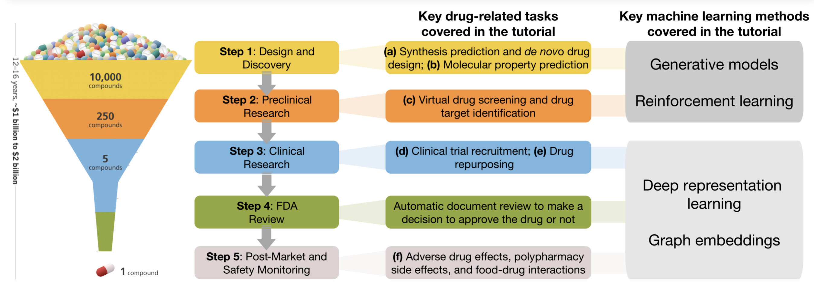

# Deep Learning in Drug Discovery

# Overview

Drug discovery and development are expensive and time-consuming processes. Developing a new drug from discovery to regulatory approval may take 12 years and cost up to $2.81 billion. Furthermore, there is a high failure rate (1:5000) at each stage of drug development [2]. With the remarkable success of machine learning in various application fields, we are seeing increasing interest in the application of machine learning in drug discovery and development [1-4]. Here, we focus on this topic and review the literature on deep learning in drug discovery.

Hosein Fooladi divides the application of deep learning in drug discovery mainly into three different categories: Drug properties prediction, De Novo drug design, and Drug-target interaction (DTI) prediction [1]. The 29th IJCAI discusses key classes of methods for tackling these drug-related tasks: Generative models, Reinforcement learning, and Deep representation learning [2].

[1] Fooladi, H. (2018, October 31). Review: Deep Learning In Drug Discovery. Hosein Fooladi. https://hfooladi.github.io/posts/2018/10/Review-Deep-Learning-In-Drug-Discovery/. 

[2] Machine Learning for Drug Development Tutorial at the 29th International Joint Conference on Artificial Intelligence (IJCAI2020) https://zitniklab.hms.harvard.edu/drugml/

[3] deepakvraghavan. (2018, May 15) Real World Deep Neural Network Architectures for Pharma Industry. https://deepakvraghavan.medium.com/real-world-deep-neural-network-architectures-for-pharma-industry-a6e885f8038f/

[4] Schneider, G. (2018). Automating drug discovery. Nature reviews drug discovery, 17(2), 97-113.

# GitHub Code

[1] A Deep Learning Library for Compound and Protein Modeling
DTI, Drug Property, PPI, DDI, Protein Function Prediction: https://github.com/kexinhuang12345/DeepPurpose

[2] A Deep Learning based Efficacy Prediction System for Drug Discovery: https://github.com/kekegg/DLEPS

# Literature Review

The following is an example, please download for details: https://github.com/ugggddd/DrugDiscoveryAI/blob/master/Drug_AI_Literature_Review.xlsx.

| Year | Title | Author | Organization | Journal | IF | Citation | DOI | DATA | Code |
| :-----| :----- | :----- | :----- | :----- | :----- | :----- | :----- | :----- | :----- | 
| 2021 | Could graph neural networks learn better molecular representation for drug discovery? A comparison study of descriptor-based and graph-based models | Guangyong Chen | Journal of cheminformatics |  5.514 (Q2) | 5 | https://doi.org/10.1186/s13321-020-00479-8 |
|2020 | Machine learning approaches to drug response prediction: challenges and recent progress | George Adam; Anna Goldenberg | University of Minnesota | npj Precision Oncology | 8.25 | 30 | https://doi.org/10.1038/s41698-020-0122-1 |

# Author and Organization

| Author Name     	 	| Organization 		| Profile    					|
| :-----| :----- | :----- |
| Jimeng Sun       		|   UIUC   			| http://www.sunlab.org/ 		|
| Hosein Fooladi        | Sharif University | https://hfooladi.github.io/   |
| Kexin Huang   		| Harvard/Stanford  | https://www.kexinhuang.com/   |
| Cao (Danica) Xiao 	| Director of Machine Learning at IQVIA 		| https://scholar.google.com/citations?user=ahaV25EAAAAJ&hl=en |
| 计算机辅助药物设计中心(袁曙光教授课题组) | Shenzhen Institutes of Advanced Technology, Chinese Academy of Sciences| http://cadd.siat.ac.cn/home/ |
|Guangyong Chen 		| Shenzhen Institute of Advanced Technology, Chinese Academy of Science | https://guangyongchen.github.io/ ｜
|Zhaoping Xiong 		| ShanghaiTech University | https://scholar.google.com/citations?user=XZ8wFwkAAAAJ&hl=en |
|Qingpeng Zhang | Hong Kong City University | http://www.cityu.edu.hk/stfprofile/zhang.htm |
| 晶泰科技 | Company | https://www.jingtaikeji.com/zh-hans/ |
| BioMap百图生科  | Company | http://www.biomap.com/ |
| 腾讯量子实验室Tencent Quantum Lab | Company  | https://quantum.tencent.com/about/ |

